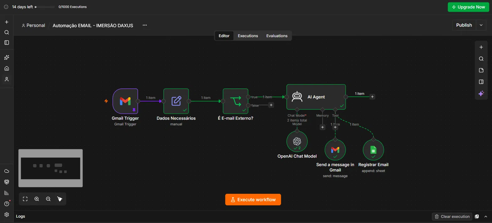
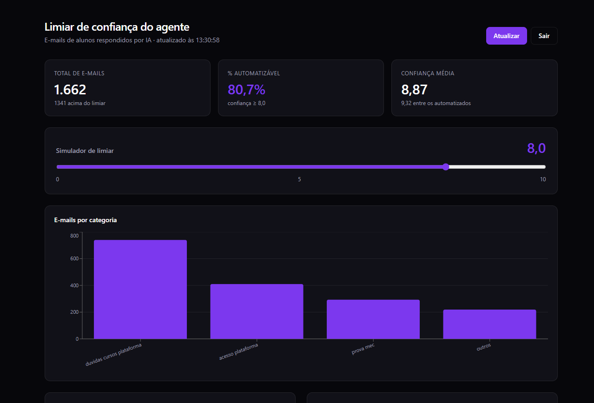

# IMERSÃO IA: Daxus

Projeto desenvolvido durante a **Imersão de IA da Daxus** (4 dias). O resultado é um agente de IA que responde e-mails de alunos automaticamente, registra tudo em uma planilha e um dashboard para decidir o **limiar de confiança** ideal do agente.

## O que foi feito

### Dia 1: Usando IA da forma correta
Fundamentos de prompt, contexto e boas práticas para tirar o máximo da IA no dia a dia.

### Dia 2: Automação de e-mails com n8n
Workflow no n8n que recebe e-mails, filtra, passa para um agente de IA e responde automaticamente.



**Fluxo:**

1. **Gmail Trigger:** dispara quando chega um novo e-mail.
2. **Dados Necessários:** extrai só os campos úteis (remetente, assunto, corpo).
3. **É e-mail externo?:** filtra e-mails internos.
4. **AI Agent (OpenAI):** entende o e-mail, classifica, gera a resposta e atribui uma nota de confiança.
5. **Ferramentas do agente:**
   - **Send a message in Gmail:** envia a resposta.
   - **Registrar Email:** salva uma linha no Google Sheets.

### Dia 3: Dashboard de limiar de confiança
Todos os e-mails recebidos pela automação do **n8n** foram salvos em uma planilha do **Google Sheets**. Em cima dela, construí este dashboard usando o **Lovable**, com o **Claude** me ajudando a planejar e refinar o projeto. Ele mostra:

- Total de e-mails processados
- % de e-mails que poderiam ser respondidos sem revisão humana
- Confiança média do agente
- **Simulador de limiar:** um slider (0 a 10) que recalcula tudo em tempo real
- Gráficos: e-mails por categoria, distribuição de confiança e % automatizável por categoria



**Colunas da planilha:** Data, Remetente, Categoria, Resumo, Resposta, Confiança.

## Stack

| Parte | Tecnologia |
| --- | --- |
| Automação | n8n, Gmail, OpenAI, Google Sheets |
| Dashboard | TanStack Start, React, TypeScript |
| Estilo e gráficos | Tailwind CSS, Recharts |
| Login | Supabase Auth |
| Criado com | Lovable e Claude |

## Rodar localmente

Requisitos: Node.js 20+.

```sh
npm install --legacy-peer-deps
npm run dev
```

Abra o endereço mostrado no terminal.

> O `--legacy-peer-deps` é necessário por causa das dependências do template.

### Configuração

O projeto usa Supabase para login. As variáveis ficam no arquivo `.env`:

```
VITE_SUPABASE_URL=
VITE_SUPABASE_PUBLISHABLE_KEY=
```

Os dados do dashboard vêm de uma planilha publicada do Google Sheets. Para usar a sua, troque a constante `SHEET_URL` em `src/routes/_authenticated/dashboard.tsx`.

> O login com Google só funciona no domínio do Lovable. Localmente, use e-mail e senha.

## Estrutura

```
src/
├── routes/
│   ├── auth.tsx                  # tela de login
│   └── _authenticated/
│       └── dashboard.tsx         # dashboard e simulador
├── integrations/                 # Supabase e Lovable
└── lib/                          # utilitários
imgs/
├── autmoacao-n8n.png             # print do workflow
└── dashboard.png                 # print do dashboard
```

## Aprendizados

- IA rende mais com contexto e instruções claras.
- Um agente de IA precisa de um **limiar de confiança** para saber quando responder sozinho e quando chamar um humano.
- Dados reais (a planilha) permitem calibrar esse limiar em vez de chutar.
